# 📚 StudyBuddy — AI-Powered Study Companion

> A full-stack web application that helps students organize courses, manage notes, upload PDFs, generate AI-powered summaries, take quizzes, and track study progress — all in one beautiful, premium interface.

---

## 📑 Table of Contents

1. [Project Overview](#-project-overview)
2. [Tech Stack](#-tech-stack)
3. [Architecture](#-architecture)
4. [Database Schema Diagram](#-database-schema-diagram)
5. [API Reference](#-api-reference)
6. [Prompt Library (AI/LLM Integration)](#-prompt-library-aillm-integration)
7. [Logic & Design Decisions](#-logic--design-decisions)
8. [Getting Started](#-getting-started)
9. [Folder Structure](#-folder-structure)
10. [Environment Variables](#-environment-variables)
11. [Stress Test & Reliability](STRESS_TEST.md)

---

## 🎯 Project Overview

StudyBuddy is built for students who want a single place to:
- **Organize** courses, typed notes, and uploaded PDF documents
- **Summarize** notes and PDFs using AI (Groq → LLaMA 3.1)
- **Quiz** themselves with AI-generated multiple-choice questions
- **Plan** study sessions on a calendar
- **Track** analytics (courses created, notes written, study time, completion rates)

---

## 🛠 Tech Stack

| Layer | Technology | Purpose |
|-------|-----------|---------|
| **Frontend** | React 18 + Vite | SPA with fast HMR |
| **Routing** | React Router v6 | Client-side navigation |
| **HTTP Client** | Axios | API calls with JWT interceptor |
| **Backend** | Express 5 (Node.js) | REST API server |
| **Database** | SQLite via `better-sqlite3` | Embedded relational DB (WAL mode) |
| **Auth** | JWT (`jsonwebtoken`) + `bcryptjs` | Stateless token-based authentication |
| **AI/LLM** | Groq Cloud API → `llama-3.1-8b-instant` | Summarization & quiz generation |
| **PDF Parsing** | `pdf-parse` | Extract text from uploaded PDFs |
| **File Upload** | `multer` | Multipart form handling |
| **Env Config** | `dotenv` | Environment variable management |

---

## 🏗 Architecture

StudyBuddy follows a **classic client-server monolith** pattern intentionally chosen for simplicity and portability.

### System Architecture Diagram

```text
┌─────────────────────────────────────────────────────────┐
│                 🌐 FRONTEND (React SPA)                 │
│         (Pages, Components, UI, AuthContext)            │
└──────────────────────────┬──────────────────────────────┘
                           │
                 HTTP REST + JWT Header
                           │
┌──────────────────────────▼──────────────────────────────┐
│                 ⚙️ BACKEND (Express.js)                 │
│ ┌─────────────────────────────────────────────────────┐ │
│ │                  🛡️ AUTH MIDDLEWARE                 │ │
│ │             (JWT Verification & Safety)             │ │
│ └──────────┬───────────────────────────────┬──────────┘ │
│            │                               │            │
│  ┌─────────▼─────────┐           ┌─────────▼─────────┐  │
│  │   Protected API   │           │   Public Routes   │  │
│  │ (Courses, Notes,  │           │  (Login, Signup,  │  │
│  │ Quiz, Analytics)  │           │     Contact)      │  │
│  └─────────┬─────────┘           └───────────────────┘  │
└────────────┼────────────────────────────────────────────┘
             │
     ┌───────┴───────┐
     │               │
┌────▼────┐     ┌────▼────┐
│ SQLite  │     │ Groq AI │
│  (DB)   │     │ (LLM)   │
└─────────┘     └─────────┘
```

### Technical Detail (Mermaid)
*(Note: If the diagrams below are not visible, please view this README on GitHub or a Mermaid-capable viewer)*

```mermaid
graph TB
    subgraph CLIENT["🌐 Frontend — React SPA (port 3000)"]
        direction TB
        PAGES["Pages<br/>LandingPage · Login · Signup<br/>Dashboard · CoursePage · NotePage<br/>QuizPage · AnalyticsPage · PlannerPage"]
        COMPONENTS["Components<br/>CourseCard · NoteEditor · NoteList<br/>SearchBar · SummaryModal · Breadcrumb"]
        UI["UI Primitives<br/>Button · Badge · Input · Modal · Toast"]
        CONTEXT["AuthContext<br/>JWT Storage · Axios Interceptor"]
        PAGES --> COMPONENTS
        COMPONENTS --> UI
        PAGES --> CONTEXT
    end

    subgraph SERVER["⚙️ Backend — Express 5 (port 5000)"]
        direction TB
        subgraph MIDDLEWARE["Middleware Layer"]
            CORS["CORS<br/>localhost whitelist"]
            JSON["express.json()<br/>Body parser"]
            AUTH_MW["Auth Middleware<br/>JWT verify"]
        end

        subgraph PUBLIC["Public Routes (no auth)"]
            AUTH_R["/auth<br/>signup · login"]
            CONTACT_R["/contact<br/>form submit"]
        end

        subgraph PROTECTED["Protected Routes (JWT required)"]
            COURSES_R["/courses<br/>CRUD"]
            NOTES_R["/courses/:id/notes<br/>CRUD + AI Summarize"]
            PDFS_R["/courses/:id/pdfs<br/>Upload + AI Summarize"]
            QUIZ_R["/courses/:id/quiz<br/>Generate · Submit · History"]
            ANALYTICS_R["/analytics<br/>Dashboard stats"]
            PLANNER_R["/planner<br/>Study sessions"]
        end

        CORS --> JSON
        JSON --> AUTH_MW
        AUTH_MW --> PROTECTED
        JSON --> PUBLIC
    end

    subgraph EXTERNAL["☁️ External Services"]
        GROQ["Groq Cloud API<br/>llama-3.1-8b-instant<br/>Summarization · Quiz Gen"]
    end

    subgraph STORAGE["💾 Data Layer"]
        SQLITE[("SQLite Database<br/>studybuddy.db<br/>7 Tables · WAL Mode")]
        UPLOADS["📁 uploads/<br/>PDF files"]
    end

    CLIENT -- "HTTP / REST<br/>Authorization: Bearer JWT" --> SERVER
    NOTES_R -- "AI Summarize" --> GROQ
    PDFS_R -- "AI Summarize" --> GROQ
    QUIZ_R -- "AI Generate" --> GROQ
    SERVER -- "better-sqlite3<br/>(sync queries)" --> SQLITE
    PDFS_R -- "multer upload" --> UPLOADS
    AUTH_R -- "bcrypt hash/verify" --> SQLITE
```



### Request Lifecycle

```mermaid
sequenceDiagram
    participant U as 👤 User Browser
    participant R as ⚛️ React App
    participant E as 🖥️ Express Server
    participant A as 🔐 Auth Middleware
    participant H as 📋 Route Handler
    participant DB as 💾 SQLite
    participant AI as 🤖 Groq API

    U->>R: Click action (e.g., Summarize Note)
    R->>R: Attach JWT from AuthContext
    R->>E: POST /courses/:id/notes/:noteId/summarize
    E->>A: Verify JWT token
    A->>A: jwt.verify(token, secret)
    A->>H: req.user = decoded payload
    H->>DB: Fetch note content
    DB-->>H: Note data
    H->>AI: Send note body + system prompt
    AI-->>H: AI-generated summary
    H->>DB: Cache summary in notes.summary
    H-->>R: { summary, cached: false }
    R-->>U: Display summary in modal
```



### AI Feature Data Flow

```mermaid
flowchart LR
    subgraph INPUT["📥 Input Sources"]
        N["📝 Notes<br/>(note body text)"]
        P["📄 PDFs<br/>(extracted text via pdf-parse)"]
    end

    subgraph PROCESSING["🔄 Backend Processing"]
        AGG["Aggregate &<br/>Truncate Content"]
        PROMPT["Build System Prompt<br/>+ User Message"]
        CALL["Groq API Call<br/>llama-3.1-8b-instant"]
        PARSE["Parse & Validate<br/>Response"]
        CACHE["Cache in SQLite"]
    end

    subgraph OUTPUT["📤 AI Outputs"]
        SUM["📋 Bullet Summaries<br/>5-6 key points"]
        QUIZ["🧠 Quiz Questions<br/>5 MCQs as JSON"]
    end

    N --> AGG
    P --> AGG
    AGG --> PROMPT
    PROMPT --> CALL
    CALL --> PARSE
    PARSE --> CACHE
    CACHE --> SUM
    CACHE --> QUIZ
```



---

## 📊 Database Schema Diagram

The SQLite database contains **7 tables** with foreign-key relationships and cascade deletes:


### Key Design Decisions

- **CASCADE deletes** — Deleting a course auto-deletes its notes, PDFs, and quizzes
- **`quizzes.questions` stored as JSON** — Avoids a separate `quiz_questions` join table, keeping queries simple for a single-user app
- **`notes.summary` and `pdfs.summary`** — AI summaries are cached in the row to avoid redundant API calls
- **WAL mode** — Write-Ahead Logging for better concurrent read performance
- **`contact_messages` is standalone** — No FK to users since it's a public form for anonymous visitors

---

## 📡 API Reference

### Public Endpoints (No Auth)

| Method | Route | Description |
|--------|-------|-------------|
| `POST` | `/auth/signup` | Register new user (name, email, password) |
| `POST` | `/auth/login` | Login → returns JWT token |
| `POST` | `/contact` | Submit contact form message |

### Protected Endpoints (JWT Required)

All require `Authorization: Bearer <token>` header.

| Method | Route | Description |
|--------|-------|-------------|
| `GET` | `/courses` | List user's courses (with note/PDF counts) |
| `POST` | `/courses` | Create a new course |
| `PUT` | `/courses/:id` | Update course name/description |
| `DELETE` | `/courses/:id` | Delete course + all children (cascade) |
| `GET` | `/courses/:id/notes` | List notes for a course |
| `POST` | `/courses/:id/notes` | Create a note |
| `PUT` | `/courses/:id/notes/:noteId` | Update a note |
| `DELETE` | `/courses/:id/notes/:noteId` | Delete a note |
| `POST` | `/courses/:id/notes/:noteId/summarize` | AI-summarize a note |
| `GET` | `/courses/:courseId/pdfs` | List PDFs for a course |
| `POST` | `/courses/:courseId/pdfs/upload` | Upload a PDF file |
| `DELETE` | `/courses/:courseId/pdfs/:pdfId` | Delete a PDF |
| `POST` | `/courses/:courseId/pdfs/:pdfId/summarize` | AI-summarize a PDF |
| `POST` | `/courses/:id/quiz/generate` | AI-generate a 5-question quiz |
| `POST` | `/courses/:id/quiz/:quizId/submit` | Submit quiz answers → get score |
| `GET` | `/courses/:id/quiz/history` | List past quizzes for a course |
| `GET` | `/analytics` | Dashboard stats (courses, notes, sessions, etc.) |
| `GET` | `/planner/sessions` | List study sessions |
| `POST` | `/planner/sessions` | Create a study session |
| `PUT` | `/planner/sessions/:id` | Update a session |
| `DELETE` | `/planner/sessions/:id` | Delete a session |
| `PATCH` | `/planner/sessions/:id/toggle` | Toggle session complete |

---

## 🤖 Prompt Library (AI/LLM Integration)

StudyBuddy uses the **Groq Cloud API** with the `llama-3.1-8b-instant` model for all AI features. Below are the exact system prompts, temperature settings, and the reasoning behind each choice.

### 1. Note Summarizer

**File:** `routes/notes.js` → `POST /courses/:id/notes/:noteId/summarize`

```
System Prompt:
"You are a helpful study assistant. Summarize study notes into exactly 5 clear,
concise bullet points. Each bullet point should capture one key concept.
Return only the bullet points, no introduction or extra text."
```

| Parameter | Value | Reasoning |
|-----------|-------|-----------|
| `model` | `llama-3.1-8b-instant` | Fast inference (< 2s), sufficient quality for bullet summaries |
| `temperature` | **0.4** | Low temperature ensures **factual, consistent** summaries. Higher values would add creative phrasing we don't want for study notes. |
| `max_tokens` | **500** | 5 bullet points rarely exceed 300 tokens; 500 gives headroom without waste |

**Why 5 bullet points?** Cognitive science suggests 5±2 items is optimal for retention. Fixed count also makes the UI predictable.

---

### 2. PDF Summarizer

**File:** `routes/pdfs.js` → `POST /courses/:courseId/pdfs/:pdfId/summarize`

```
System Prompt:
"You are a helpful study assistant. Summarize the given PDF content into exactly
6 clear bullet points. Each bullet point must start with '• '. Focus on the most
important concepts a student needs to know. Return only bullet points, nothing else."
```

| Parameter | Value | Reasoning |
|-----------|-------|-----------|
| `model` | `llama-3.1-8b-instant` | Same model for consistency |
| `temperature` | **0.4** | Same low-creativity rationale as notes |
| `max_tokens` | **600** | 6 bullets + PDF content tends to be denser than notes |
| Input limit | **3,000 chars** | PDFs can be thousands of pages; we truncate to fit the 8K context window and keep latency low |

**Why 6 bullets (vs. 5 for notes)?** PDFs are typically richer and denser than handwritten notes, warranting one extra point.

---

### 3. Quiz Generator

**File:** `routes/quiz.js` → `POST /courses/:id/quiz/generate`

```
System Prompt:
"You are a quiz generator for students. Given study material, generate exactly
5 multiple-choice questions to test understanding.

Return ONLY a valid JSON array with this exact format (no markdown, no code fences,
no extra text):
[
  {
    "question": "What is ...?",
    "options": ["Option A", "Option B", "Option C", "Option D"],
    "correctIndex": 0
  }
]

Rules:
- Exactly 5 questions
- Exactly 4 options each
- correctIndex is 0-3 (index of the correct option)
- Questions should test understanding, not just memorization
- Mix difficulty levels
- Return ONLY the JSON array, nothing else"
```

| Parameter | Value | Reasoning |
|-----------|-------|-----------|
| `model` | `llama-3.1-8b-instant` | Fast enough for interactive quiz generation (< 3s) |
| `temperature` | **0.5** | Slightly higher than summarization to encourage **diverse question phrasing** and varied wrong-answer distractors. Too low (0.2) would make questions repetitive; too high (0.8+) would produce creative but factually unreliable options. |
| `max_tokens` | **1,500** | 5 questions × 4 options needs ~800–1,200 tokens in JSON format |
| Input limit | **4,000 chars** | Quiz material aggregates all notes + PDF summaries for a course |

**Why structured JSON output?** The frontend needs to programmatically render option cards and score answers. Natural-language output would require fragile regex parsing. The prompt explicitly bans markdown/code-fences because LLMs often wrap JSON in triple backticks — we strip these as a fallback too.

**Why "test understanding, not memorization"?** Bloom's taxonomy suggests higher-order questions (application, analysis) are more valuable than recall. This instruction nudges the model toward "Why does X happen?" over "What year was X?".

---

### Prompt Design Patterns Used

| Pattern | Where | Purpose |
|---------|-------|---------|
| **Structured Output** | Quiz generator | Forces strict JSON format for programmatic consumption |
| **Fixed Count Constraint** | All 3 prompts | "Exactly N items" prevents variable-length responses |
| **Negative Instructions** | All 3 prompts | "No introduction, no extra text" reduces post-processing |
| **Role Assignment** | All 3 prompts | "You are a study assistant" grounds the model's persona |
| **Few-Shot by Example** | Quiz generator | Inline JSON example acts as a one-shot template |

---

## 🧩 Logic & Design Decisions

### Why Express + SQLite (not Next.js + PostgreSQL)?

| Factor | Our Choice | Alternative | Rationale |
|--------|-----------|-------------|-----------|
| **Deployment** | Single `node server.js` | Docker + managed DB | Zero infrastructure — runs on any machine with Node |
| **Database** | SQLite (file-based) | PostgreSQL, MongoDB | No server to install; perfect for single-user or small-group study apps |
| **ORM** | Raw `better-sqlite3` | Prisma, Sequelize | Synchronous API = simpler code; no migration tooling overhead for 7 tables |
| **Frontend** | Vite + React SPA | Next.js SSR | Client-side rendering is fine here — no SEO needed for a logged-in dashboard app |

### Why JWT with Bearer Tokens (not Sessions)?

- **Stateless** — No server-side session store needed. The SQLite DB doesn't need a sessions table.
- **Simple CORS** — Token in `Authorization` header avoids cookie CORS headaches between port 3000 (frontend) and 5000 (backend).
- **Mobile-ready** — If the app ever gets a mobile client, token auth works identically.

### Middleware Pattern

```
Client Request
  → CORS Middleware (whitelist localhost:*)
  → express.json() parser
  → Route-level Auth Middleware (JWT verify)
  → Route Handler
  → Response
```

We apply `authMiddleware` **per-route-group**, not globally. This allows `/auth` and `/contact` to remain public while all `/courses`, `/analytics`, `/planner`, and `/quiz` routes require a valid token.

```javascript
// Public — no middleware
app.use('/auth', authRouter);
app.use('/contact', contactRouter);

// Protected — JWT required
app.use('/courses', authMiddleware, coursesRouter);
app.use('/analytics', authMiddleware, analyticsRouter);
```

### Why Groq + LLaMA 3.1 (not OpenAI GPT-4)?

| Factor | Groq + LLaMA 3.1 8B | OpenAI GPT-4 |
|--------|---------------------|--------------|
| **Speed** | ~1–2s responses | ~5–10s responses |
| **Cost** | Free tier available | $0.03–0.06 per 1K tokens |
| **Quality** | Sufficient for summaries & MCQs | Higher quality, but overkill |
| **API** | OpenAI-compatible endpoint | Proprietary |

For study summaries and quiz generation, LLaMA 3.1 8B provides **fast, accurate, and free** results. The tasks don't require GPT-4-level reasoning.

### Why Cache Summaries in DB?

AI API calls are the slowest operation (~1–2 seconds). We cache summaries directly in the `notes.summary` and `pdfs.summary` columns:
- First request → call Groq API → save to DB → return `{ summary, cached: false }`
- Subsequent requests → return DB value → `{ summary, cached: true }`

This avoids redundant API calls and provides instant responses for previously summarized content.

---

## 🚀 Getting Started

### Prerequisites
- **Node.js** ≥ 18 (required for native `fetch`)
- **npm** ≥ 9
- A **Groq API key** (free at [console.groq.com](https://console.groq.com))

### Installation

```bash
# Clone the repository
git clone https://github.com/your-username/studybuddy.git
cd studybuddy

# ── Backend Setup ──
cd backend
npm install

# Create .env file
echo "GROQ_API_KEY=your_groq_api_key_here" > .env
echo "PORT=5000" >> .env
echo "JWT_SECRET=your_secret_key_here" >> .env

# Start the server
node server.js
# ✅ Database initialized successfully
# 🚀 StudyBuddy backend running at http://localhost:5000

# ── Frontend Setup (new terminal) ──
cd ../frontend
npm install
npm run dev
# ➜ Local: http://localhost:3000/
```

### First-Time Usage
1. Open `http://localhost:3000` in your browser
2. Click **Sign Up** and create an account
3. Create a course → add notes → click **Summarize** to test AI
4. Upload a PDF → click **Summarize** to test AI on PDFs
5. Click **🧠 Quiz** to generate AI questions from your material

---

## 📁 Folder Structure

```
StudyBuddy/
├── backend/
│   ├── .env                    # GROQ_API_KEY, PORT, JWT_SECRET
│   ├── server.js               # Express app entry point
│   ├── db.js                   # SQLite init, 7 tables
│   ├── package.json
│   ├── middleware/
│   │   └── auth.js             # JWT verification middleware
│   ├── routes/
│   │   ├── auth.js             # Signup/login (public)
│   │   ├── contact.js          # Contact form (public)
│   │   ├── courses.js          # CRUD + note/PDF counts
│   │   ├── notes.js            # CRUD + AI summarization
│   │   ├── pdfs.js             # Upload + AI summarization
│   │   ├── quiz.js             # AI quiz generate/submit/history
│   │   ├── analytics.js        # Dashboard statistics
│   │   └── planner.js          # Study session scheduling
│   ├── uploads/                # Uploaded PDF files
│   └── studybuddy.db           # SQLite database file
│
└── frontend/
    ├── package.json
    ├── vite.config.js
    └── src/
        ├── App.jsx             # Root component + routes
        ├── main.jsx            # React DOM entry point
        ├── styles/
        │   └── global.css      # Design system (CSS variables)
        ├── context/
        │   └── AuthContext.jsx  # Auth state + Axios interceptor
        ├── components/
        │   ├── Breadcrumb.jsx
        │   ├── CourseCard.jsx
        │   ├── NoteEditor.jsx
        │   ├── NoteList.jsx
        │   ├── ProtectedRoute.jsx
        │   ├── SearchBar.jsx
        │   ├── SummaryModal.jsx
        │   └── ui/             # Reusable UI primitives
        │       ├── Badge.jsx
        │       ├── Button.jsx
        │       ├── Input.jsx
        │       ├── Modal.jsx
        │       └── Toast.jsx
        └── pages/
            ├── LandingPage.jsx   # Public marketing page + contact form
            ├── LoginPage.jsx     # Auth login
            ├── SignupPage.jsx    # Auth signup
            ├── Dashboard.jsx     # Course grid + search + stats
            ├── CoursePage.jsx    # Notes/PDFs tabs + quiz button
            ├── NotePage.jsx      # Note detail + AI summarize
            ├── QuizPage.jsx      # AI quiz: generate → take → results
            ├── AnalyticsPage.jsx # Study analytics dashboard
            └── PlannerPage.jsx   # Study session calendar
```

---

## 🔐 Environment Variables

Create a `.env` file in the `backend/` directory:

| Variable | Required | Description |
|----------|----------|-------------|
| `GROQ_API_KEY` | ✅ | Your Groq Cloud API key for AI features |
| `PORT` | ❌ | Backend server port (default: `5000`) |
| `JWT_SECRET` | ✅ | Secret key for signing JWT tokens |

---

## 📄 License

MIT © StudyBuddy
